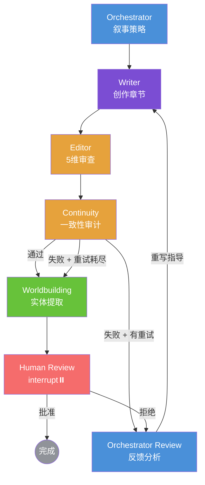

# Novel Agent

基于 LangGraph 的开源多 Agent 小说写作框架，支持短篇/中篇/长篇多种篇幅 — 支持 Human-in-the-loop。

[](https://opensource.org/licenses/MIT)
[](https://www.python.org/downloads/)

## 架构



**7 节点 + 反馈闭环 + Human-in-the-loop：**

| 节点 | 职责 | 模型层级 |
|------|------|----------|
| Orchestrator | 叙事阶段分析、章节策略、篇幅感知节奏 | Budget |
| Writer | 章节创作 + 去 AI 味规则 + 工具调用 | Quality |
| Editor | 5 维度审查（节奏、AI 味、对话、逻辑、文笔） | Budget |
| Continuity | 跨章节一致性审计（角色、时间线、世界观规则） | Budget |
| Orchestrator Review | 分析失败报告，生成具体重写指导 | Budget |
| Worldbuilding | 实体提取、冲突检测、持久化到 SQLite | Budget |
| Human Review | **LangGraph `interrupt()`** — 暂停流水线，等待人类输入 | — |

### 双层记忆

- **短期记忆**：ContextCompressor 将前文章节压缩为摘要（约 40K token 阈值）
- **长期记忆**：ChromaDB 向量存储 + SQLite 结构化存储（项目、章节、世界观实体、伏笔）

### 篇幅支持

三种篇幅，各有节奏策略，每章字数可配置：

| 篇幅 | 默认字/章 | 叙事节奏 |
|------|----------|---------|
| `short` | 1500 | 快速推进，跳过 intro，3-5 章到达高潮 |
| `novella` | 3000 | 平衡发展，高潮在 60-70% 处 |
| `long` | 3000 | 渐进展开，多线并进，伏笔长线回收 |

## 快速开始

### 环境要求

- Python 3.12+
- [uv](https://docs.astral.sh/uv/)
- OpenAI 兼容 API（OpenAI、DeepSeek 等）

### 安装

```bash
git clone https://github.com/your-org/novel-agent.git
cd novel-agent
uv sync
```

### 配置

```bash
cp .env.example .env
# 编辑 .env，填入 API key 和模型偏好
```

### CLI 使用

```bash
# 初始化项目（含篇幅设置）
novel-agent init -n "MyNovel" -t "我的小说" -g "都市" -l long -w 3000

# 完整流水线生成（O→W→E→C→WB→Human Review）
novel-agent write -c 1 -o "主角穿越到异世界，发现拥有系统"

# 单章覆盖字数
novel-agent write -c 1 -o "战斗场景" -w 5000

# 快速生成（仅 Writer，跳过审查）
novel-agent quick -c 1 -o "主角穿越到异世界"

# 查看 trace
novel-agent trace ls
novel-agent trace show traces/trace-xxx.json
```

### Human-in-the-loop

运行 `novel-agent write` 时，流水线在 Human Review 处暂停：

```
============================================================
  HUMAN REVIEW — Chapter 1
============================================================
  Editor: 85/100  |  Continuity: 92/100
  Retries: 0

  ── Draft Preview ──
  [草稿预览...]

  Approve or reject? (approve/reject) [a]:
```

输入 `a`/`approve` 批准，或 `r`/`reject` 并附修改意见触发带指导的重写。

### Web UI

```bash
chainlit run novel_agent/api/app.py
```

打开 http://localhost:8000 ，通过按钮点击（而非 CLI 输入）进行审批。

### Docker

```bash
docker compose up chainlit    # Web UI
docker compose run novel-agent write -c 1 -o "大纲"  # CLI
```

## 配置

| 变量 | 说明 | 默认值 |
|------|------|--------|
| `OPENAI_API_KEY` | API 密钥 | - |
| `OPENAI_BASE_URL` | API 地址 | `https://api.openai.com/v1` |
| `BUDGET_MODEL` | 结构化/审查工作模型 | `deepseek-chat` |
| `QUALITY_MODEL` | 创意写作模型 | 同 BUDGET |

## 项目结构

```
novel_agent/
├── agents/              # 5 个专用 Agent + 基类
│   ├── base.py          # BaseAgent（工具调用循环）
│   ├── writer.py        # 章节创作（含 search_context 工具）
│   ├── editor.py        # 5 维审查 + DetectAiFlavorTool
│   ├── continuity.py    # 跨章节一致性审计
│   ├── orchestrator.py  # 叙事策略 + 反馈分析
│   └── worldbuilding.py # 实体提取 + 冲突检测
├── graph/               # LangGraph StateGraph
│   ├── state.py         # NovelState TypedDict
│   └── chapter.py       # 7 节点流水线（反馈闭环 + HITL）
├── memory/              # 双层记忆系统
│   ├── compressor.py    # ContextCompressor（40K token 阈值）
│   └── embeddings.py    # ChromaDB 向量存储
├── storage/             # SQLite 持久化
│   ├── models.py        # Schema + 迁移
│   └── manager.py       # ProjectManager（章节、实体管理）
├── schema/              # 输出校验边界
│   ├── models.py        # 所有 Agent 输出的 Pydantic 模型
│   ├── parser.py        # JSON 解析器（3 层兜底）
│   └── validator.py     # OutputValidator（3 层强制转换）
├── routing/             # 模型路由（双模型、运行时读环境变量）
├── trace/               # JSON trace 采集 + Rich CLI 查看器
├── tools/               # MCP 兼容工具协议
├── style/               # AI 味检测引擎（30+ 规则模式）
├── api/                 # Chainlit Web UI（支持 HITL 按钮）
└── cli/                 # Click CLI（支持交互式人工审批）
```

## License

MIT
