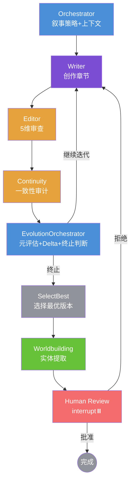

# Novel Agent

基于 LangGraph 的开源多 Agent 小说写作框架。递归自进化流水线，内建自动迭代与人工审批机制，面向长篇创作，提供 CLI / Web SPA / Chainlit 三种交互方式。

[](https://opensource.org/licenses/MIT)
[](https://www.python.org/downloads/)
[](https://docs.astral.sh/uv/)

## 功能亮点

| 功能 | 说明 |
|------|------|
| 递归自进化流水线 | Orchestrator → 进化子图（Writer → Editor → Continuity → EvolutionOrchestrator）→ Worldbuilding → Human Review，多轮迭代直至收敛或触顶 |
| 流式写作 | SSE 实时推送，逐字渲染创作过程，非一次性返回 |
| 知识图谱可视化 | Cytoscape.js 渲染角色/地点/物品/组织/事件的关系网络，支持逐章回溯 |
| 长篇写作策略 | 3000 字/章，渐进展开、多线并进、伏笔长线回收 |
| 双模型路由 | Quality 模型负责创作，Budget 模型负责审查/分析/抽取，按任务自动分配 |
| 质量保障 | 递归自进化（版本对比 + Delta 分析 + 7 种终止条件）+ 人工审批，支持 Web / Chainlit 两种审批方式 |
| 双层记忆 | 短期摘要（ContextCompressor）+ 长期向量/结构化存储（ChromaDB + SQLite） |
| 可观测性 | 调用元数据采集 + LangFuse 全链路追踪 |
| 三种交互方式 | CLI（服务/导出/运维）/ Web SPA（React）/ Chainlit（对话式，legacy），共享同一后端 |

## 系统架构

```
┌─────────────────────────────────────────────────────┐
│                    交互层                            │
│  React SPA (Vite)  │  CLI (Click)  │  Chainlit UI   │
└───────────────────────┬─────────────────────────────┘
                        │  REST + SSE
┌───────────────────────▼─────────────────────────────┐
│                 FastAPI 网关                         │
│  routes.py  │  sse.py  │  outline.py  │  graph_data  │
└───────────────────────┬─────────────────────────────┘
                        │
┌───────────────────────▼─────────────────────────────┐
│           LangGraph StateGraph（递归自进化）          │
│                                                     │
│  Orchestrator → [ Writer → Editor → Continuity      │
│                       └─────┬────────────────┐      │
│                    EvolutionOrchestrator     │      │
│                     （继续迭代 ↑ / 选择最优 ↓）│      │
│                          SelectBest          │      │
│                  ] → Worldbuilding → Human Review    │
│                              │                      │
│                    批准 → END / 拒绝 → 回到进化      │
└───────────────────────┬─────────────────────────────┘
                        │
┌───────────────────────▼─────────────────────────────┐
│                   存储层                             │
│    SQLite (项目/章节/实体/关系)  │  ChromaDB (向量记忆)│
└─────────────────────────────────────────────────────┘
```

**Agent 流水线细节：**



| 节点 | 职责 | 模型层级 |
|------|------|----------|
| Orchestrator | 叙事阶段分析、篇幅感知策略、上下文组装 | Budget |
| Writer | 章节创作 + 去 AI 味规则 + 工具调用 | Quality |
| Editor | 5 维度审查（节奏、AI 味、对话、逻辑、文笔） | Budget |
| Continuity | 跨章节一致性审计（角色、时间线、世界观规则） | Budget |
| EvolutionOrchestrator | 元评估：版本对比、Delta 分析、硬约束检查、终止判断、改进计划 | Budget |
| SelectBest | 硬约束优先 + 多目标选择（Pareto → 综合分兜底），一次性落库 | —（规则层） |
| Worldbuilding | 实体提取、冲突检测、持久化到 SQLite | Budget |
| Human Review | LangGraph `interrupt()` — 暂停流水线，等待人类输入 | — |

## 快速开始

### 环境要求

- Python 3.12+
- [uv](https://docs.astral.sh/uv/)（包管理与运行）
- Node.js 20.19+ 或 22+（仅 Web UI 需要，Vite 8 要求）
- OpenAI 兼容 API（OpenAI、DeepSeek 等）

### 安装

```bash
git clone https://github.com/alph-cmky/novel-agent.git
cd novel-agent
uv sync
```

前端（可选，仅 Web UI 需要）：

```bash
cd frontend
npm install
```

### 配置

```bash
cp .env.example .env
# 编辑 .env，填入 API key 和模型偏好
```

最低只需 `OPENAI_API_KEY`；使用不同供应商为 Quality / Budget 模型单独配置时，可设置 `QUALITY_API_KEY` / `BUDGET_API_KEY`（详见「配置参考」）。

### CLI 使用

```bash
# 启动 Web 服务
novel-agent serve

# 自定义端口 + 热重载（开发模式）
novel-agent serve --host 0.0.0.0 --port 8080 --reload

# 导出小说
novel-agent export                  # Markdown 格式，输出到 stdout
novel-agent export -p <project-id>  # 指定项目（默认第一个项目）
novel-agent export -o novel.md      # 保存到文件
novel-agent export -f txt -o novel.txt  # 纯文本格式

```

### Web UI

```bash
# 一行命令启动（推荐）
novel-agent serve

# 或手动启动后端
uv run uvicorn novel_agent.api.app:app --host 0.0.0.0 --port 8000
```

启动前端开发服务器（热更新）：

```bash
cd frontend && npm run dev
```

打开 http://localhost:5173 ，提供项目管理、大纲规划、流式写作和关系图谱可视化。

生产模式（前端构建后由 FastAPI 直接 serve）：

```bash
cd frontend && npm run build && cd ..
novel-agent serve
```

### Docker

```bash
docker compose up web          # FastAPI + React Web UI（http://localhost:8000）
docker compose --profile cli run cli   # 交互式 CLI（可选 profile）
```

## 核心特性

### 递归自进化

流水线内建自动迭代与人工审批两层机制，自动修复不动的才交给人。

**进化子图** — 每轮 `Writer → Editor → Continuity` 产出评估报告，`EvolutionOrchestrator` 对比上轮计算各维度 Delta，生成结构化 `improvement_plan`（focus_dimensions + preserve + avoid）驱动下一轮创作。进化过程中不写 DB（只存 LangGraph checkpoint），结束一次性落库。

**max_rounds 语义** — `max_rounds` 计数 Writer 的真实重写次数，不含首次评估记录：
- `max_rounds=0`：只生成初稿，不进行任何重写
- `max_rounds=1`：允许一次真实重写
- `max_rounds=2`：允许两次真实重写

**终止条件** — 8 种终止状态（按优先级）：

| 终止状态 | 触发条件 |
|---------|---------|
| `hard_constraint_violation` | 篇幅低于最优版本 85%、一致性错误增加、大纲覆盖率下降 |
| `quality_regression` | 单维度或 Editor 总分暴跌超过阈值 |
| `regressed` | 综合分低于历史最优 5 分以上 |
| `ceiling` | 所有维度均超 90 分 |
| `max_rounds` | 达到最大重写轮次 |
| `convergence` | 所有维度 Delta 绝对值低于阈值 |
| `plateau` | 连续 2 轮所有 Delta 均低于阈值 |
| `timeout` / `rate_limited` | 外部调用超时或触发频率限制 |

**硬约束（Quality Guards）** — 版本选择优先检查硬约束，不通过则拒绝替换最优版本：
- 篇幅不得低于最优版本的 85%
- 不得引入新的 critical / major 一致性错误
- 大纲覆盖率不得下降
- 必要事实不得丢失

**版本选择（SelectBest）** — 硬约束通过后，使用 Pareto + 综合分兜底的多目标选择：所有维度不退化且至少一个维度提升 → 直接接受；否则按加权综合分决定。

**人工审批** — 进化终止后，流水线在 `Human Review` 节点暂停，等待人类决定。Web UI 按钮式审批（Approve/Reject）可附带修改意见触发新一轮进化（拒绝后最多再迭代 2 轮，累计最多 3 次拒绝）。

### Fast Profile

长篇场景下可启用 fast profile 降低单章耗时：

| 参数 | 说明 | 默认值 |
|------|------|--------|
| `skip_reviews` | 跳过 Editor + Continuity 审查 | `false` |
| `review_interval` | 每 N 章执行一次完整审查 | `1` |
| `skip_worldbuilding` | 跳过 Worldbuilding 实体提取 | `false` |
| `skip_evolution_enrichment` | 关闭 EvolutionOrchestrator 的 LLM enrichment | `false` |

### 双层记忆

- **短期记忆**：ContextCompressor 将前文章节压缩为摘要（约 40K token 阈值）
- **长期记忆**：ChromaDB 向量存储 + SQLite 结构化存储（项目、章节、世界观实体、关系、伏笔）

### 长篇写作

专为长篇设计：默认 3000 字/章，叙事节奏「渐进展开，多线并进，伏笔长线回收」，典型体量 100 章以上。

## 配置参考

| 变量 | 说明 | 默认值 |
|------|------|--------|
| `OPENAI_API_KEY` | API 密钥（Quality / Budget 未单独配置时的兜底） | - |
| `OPENAI_BASE_URL` | API 地址 | `https://api.openai.com/v1` |
| `BUDGET_MODEL` | 结构化/审查/抽取模型 | `deepseek-chat` |
| `QUALITY_MODEL` | 创意写作模型 | 同 `BUDGET_MODEL` |
| `BUDGET_API_KEY` | Budget 模型独立密钥 | 同 `OPENAI_API_KEY` |
| `BUDGET_BASE_URL` | Budget 模型独立地址 | 同 `OPENAI_BASE_URL` |
| `QUALITY_API_KEY` | Quality 模型独立密钥 | 同 `OPENAI_API_KEY` |
| `QUALITY_BASE_URL` | Quality 模型独立地址 | 同 `OPENAI_BASE_URL` |
| `LANGFUSE_PUBLIC_KEY` | LangFuse 追踪公钥（可选，留空禁用） | - |
| `LANGFUSE_SECRET_KEY` | LangFuse 追踪私钥 | - |
| `LANGFUSE_HOST` | LangFuse 地址 | `https://cloud.langfuse.com` |
| `NOVEL_DATA_DIR` | 数据目录（SQLite + checkpoint） | `./novel-data` |

模型路由按任务分类自动分配：`CREATIVE` → Quality 模型（温度 0.85），`STRUCTURAL` / `REVIEW` / `EXTRACTION` / `META_EVALUATION` → Budget 模型（温度 0.2–0.4）。

## 项目结构

```
novel_agent/
├── agents/              # 6 个专用 Agent + 基类
│   ├── base.py          # BaseAgent（工具调用循环 + 调用元数据）
│   ├── orchestrator.py  # 叙事策略 + 上下文组装
│   ├── writer.py        # 章节创作（含 search_context 工具）
│   ├── editor.py        # 5 维审查 + DetectAiFlavorTool
│   ├── continuity.py    # 跨章节一致性审计
│   ├── worldbuilding.py # 实体提取 + 冲突检测
│   └── evolution_orchestrator.py # 元评估 + 改进计划（LLM 增强层）
├── graph/               # LangGraph StateGraph
│   ├── state.py         # NovelState TypedDict
│   ├── chapter.py       # 流水线组装（进化子图 + HITL）
│   └── evolution.py     # 进化规则层（Delta / 终止判断 / 改进计划）
├── memory/              # 双层记忆系统
│   ├── compressor.py    # ContextCompressor（40K token 阈值）
│   └── embeddings.py    # ChromaDB 向量存储
├── storage/             # SQLite 持久化
│   ├── models.py        # Schema + 迁移
│   └── manager.py       # ProjectManager（章节、实体、关系管理）
├── schema/              # 输出校验边界
│   ├── models.py        # 所有 Agent 输出的 Pydantic 模型
│   ├── enums.py         # 状态枚举（章节/大纲生命周期）
│   ├── parser.py        # JSON 解析器（多层兜底）
│   └── validator.py     # OutputValidator（类型强制 + 默认值兜底）
├── model_router.py      # 模型路由（双模型、运行时读环境变量）
├── observability/       # LangFuse 全链路追踪（未配置则 no-op）
├── tools/               # 工具协议（MCP 兼容 schema 模式）
├── style/               # AI 味检测引擎（禁用句式 + 启发式检查）
├── api/                 # FastAPI REST + SSE
│   ├── routes.py        # REST API（项目 CRUD、大纲、导出）
│   ├── sse.py           # SSE 流式写作 + Session 管理
│   ├── graph_data.py    # 关系图谱数据聚合
│   ├── outline.py       # AI 大纲生成
│   ├── app.py           # FastAPI 应用（CORS + 静态资源 + 生命周期）
└── cli/                 # Click CLI（serve / export）

frontend/                # React SPA（Vite + TypeScript + Tailwind）
└── src/pages/           # 看板 / 大纲 / 写作 / 设置
```

## License

MIT

## 当前限制

- 项目处于 Alpha 阶段，核心目标是验证 Agent 工作流、状态恢复、记忆和人工审批机制。
- 真实模型调用、长篇质量和运行成本取决于所选模型与配置；仓库测试默认不调用真实 LLM。
- 部分历史兼容字段仍保留，但 Web UI 是推荐入口。
- 仓库不包含个人运行数据、数据库、checkpoint 或 API 密钥；请从 `.env.example` 创建本地配置。
