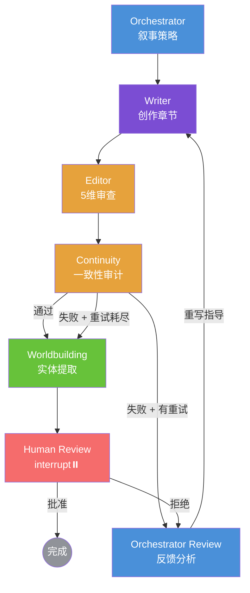

# Novel Agent

基于 LangGraph 的开源多 Agent 小说写作框架。7 节点流水线，内建自动反馈闭环与人工审批机制，支持三种篇幅策略，提供 CLI / Web SPA / Chainlit 三种交互方式。

[](https://opensource.org/licenses/MIT)
[](https://www.python.org/downloads/)

## 功能亮点

| 功能 | 说明 |
|------|------|
| 多 Agent 协作流水线 | Orchestrator → Writer → Editor → Continuity → Worldbuilding → Human Review，7 节点各司其职 |
| 流式写作 | SSE 实时推送，逐字渲染创作过程，非一次性返回 |
| 知识图谱可视化 | Cytoscape.js 渲染角色/地点/物品/组织/事件的关系网络，支持逐章回溯 |
| 长篇写作策略 | 3000字/章，渐进展开，多线并进，伏笔长线回收 |
| 模型路由 | Quality 模型负责创作，Budget 模型负责审查，按任务自动分配 |
| 质量保障 | 递归自进化（更多维度评估，多轮迭代）+ 人工审批，支持 CLI / Web UI 两种审批方式 |
| 三种交互方式 | CLI（服务/导出/运维）/ Web SPA（React）/ Chainlit（对话式），共享同一后端 |

## 系统架构

```
┌─────────────────────────────────────────────────────┐
│                    交互层                            │
│  React SPA (Vite)  │  CLI (Click)  │  Chainlit UI   │
└───────────────────────┬─────────────────────────────┘
                        │  REST + SSE
┌───────────────────────▼─────────────────────────────┐
│                 FastAPI 网关                         │
│  routes.py  │  sse.py  │  outline.py  │  graph_data │
└───────────────────────┬─────────────────────────────┘
                        │
┌───────────────────────▼─────────────────────────────┐
│              LangGraph StateGraph                   │
│                                                     │
│  Orchestrator → Writer → Editor → Continuity        │
│       ▲              ▲         │                    │
│       │              │    ┌────┴────┐               │
│       │  重写指导     │   pass     fail              │
│       │              │    │         │               │
│       │     ┌────────┘  Worldbuilding               │
│       │     │                │                      │
│       │  Orchestrator   Human Review                │
│       │    Review       (interrupt)                 │
│       └─────┘                │                      │
│                         批准/拒绝                    │
└───────────────────────┬─────────────────────────────┘
                        │
┌───────────────────────▼─────────────────────────────┐
│                   存储层                             │
│    SQLite (项目/章节/实体)  │  ChromaDB (向量记忆)    │
└─────────────────────────────────────────────────────┘
```

**Agent 流水线细节：**



| 节点 | 职责 | 模型层级 |
|------|------|----------|
| Orchestrator | 叙事阶段分析、章节策略、篇幅感知节奏 | Budget |
| Writer | 章节创作 + 去 AI 味规则 + 工具调用 | Quality |
| Editor | 5 维度审查（节奏、AI 味、对话、逻辑、文笔） | Budget |
| Continuity | 跨章节一致性审计（角色、时间线、世界观规则） | Budget |
| Orchestrator Review | 分析失败报告，生成具体重写指导 | Budget |
| Worldbuilding | 实体提取、冲突检测、持久化到 SQLite | Budget |
| Human Review | LangGraph `interrupt()` — 暂停流水线，等待人类输入 | — |

## 快速开始

### 环境要求

- Python 3.12+
- [uv](https://docs.astral.sh/uv/)
- Node.js 18+（仅 Web UI 需要）
- OpenAI 兼容 API（OpenAI、DeepSeek 等）

### 安装

```bash
git clone https://github.com/your-org/novel-agent.git
cd novel-agent
uv sync
```

前端（可选，仅 Web UI 需要）：

```bash
cd frontend
npm install
```

### 配置

```bash
cp .env.example .env
# 编辑 .env，填入 API key 和模型偏好
```

### CLI 使用

```bash
# 启动 Web 服务
novel-agent serve

# 自定义端口 + 热重载（开发模式）
novel-agent serve --port 8080 --reload

# 导出小说
novel-agent export                  # Markdown 格式，输出到 stdout
novel-agent export -o novel.md      # 保存到文件
novel-agent export -f txt -o novel.txt  # 纯文本格式

# 调试 trace
novel-agent trace ls
novel-agent trace show traces/trace-xxx.json
```

### Web UI

```bash
# 一行命令启动（推荐）
novel-agent serve

# 或手动启动后端
uv run uvicorn novel_agent.api.app:app --host 0.0.0.0 --port 8000
```

启动前端开发服务器（热更新）：

```bash
cd frontend && npm run dev
```

打开 http://localhost:5173 ，提供项目管理、大纲规划、流式写作和关系图谱可视化。

生产模式（前端构建后由 FastAPI 直接 serve）：

```bash
cd frontend && npm run build && cd ..
novel-agent serve
```

> 也支持 Chainlit 传统 UI：`chainlit run novel_agent/api/chainlit_app.py`

### Docker

```bash
docker compose up web        # FastAPI + React Web UI (port 8000)
docker compose up chainlit   # Chainlit 传统 UI (port 8001)
```

## 核心特性

### 质量保障

流水线内建两层质量机制，自动修复不动的才交给人：

**自动反馈闭环** — Editor/Continuity 发现问题后，Orchestrator Review 分析失败报告，生成具体重写指导（如"角色语气不一致，第1章是愤世嫉俗的，这里变成了乐观"）。Writer 收到指导后在 prompt 最前面插入，重新创作后再次进入审查。最多 3 次自动重试。

**人工审批** — 自动重试耗尽、或质量达标后，流水线暂停等待人类决定。CLI 终端交互式输入 `approve`/`reject`，Web UI 按钮式审批，均可附带修改意见触发带反馈的重写。

```
# CLI 审批界面
============================================================
  HUMAN REVIEW — Chapter 1
============================================================
  Editor: 85/100  |  Continuity: 92/100
  Retries: 0

  ── Draft Preview ──
  [草稿预览...]

  Approve or reject? (approve/reject) [a]:
```

### 双层记忆

- **短期记忆**：ContextCompressor 将前文章节压缩为摘要（约 40K token 阈值）
- **长期记忆**：ChromaDB 向量存储 + SQLite 结构化存储（项目、章节、世界观实体、伏笔）

### 篇幅支持

三种篇幅，各有节奏策略，每章字数可配置：

| 篇幅 | 默认字/章 | 叙事节奏 |
|------|----------|---------|
| `long` | 3000 | 渐进展开，多线并进，伏笔长线回收 |

## 配置参考

| 变量 | 说明 | 默认值 |
|------|------|--------|
| `OPENAI_API_KEY` | API 密钥 | - |
| `OPENAI_BASE_URL` | API 地址 | `https://api.openai.com/v1` |
| `BUDGET_MODEL` | 结构化/审查工作模型 | `deepseek-chat` |
| `QUALITY_MODEL` | 创意写作模型 | 同 BUDGET |

## 项目结构

```
novel_agent/
├── agents/              # 5 个专用 Agent + 基类
│   ├── base.py          # BaseAgent（工具调用循环）
│   ├── writer.py        # 章节创作（含 search_context 工具）
│   ├── editor.py        # 5 维审查 + DetectAiFlavorTool
│   ├── continuity.py    # 跨章节一致性审计
│   ├── orchestrator.py  # 叙事策略 + 反馈分析
│   └── worldbuilding.py # 实体提取 + 冲突检测
├── graph/               # LangGraph StateGraph
│   ├── state.py         # NovelState TypedDict
│   └── chapter.py       # 7 节点流水线（反馈闭环 + HITL）
├── memory/              # 双层记忆系统
│   ├── compressor.py    # ContextCompressor（40K token 阈值）
│   └── embeddings.py    # ChromaDB 向量存储
├── storage/             # SQLite 持久化
│   ├── models.py        # Schema + 迁移
│   └── manager.py       # ProjectManager（章节、实体管理）
├── schema/              # 输出校验边界
│   ├── models.py        # 所有 Agent 输出的 Pydantic 模型
│   ├── parser.py        # JSON 解析器（3 层兜底）
│   └── validator.py     # OutputValidator（3 层强制转换）
├── routing/             # 模型路由（双模型、运行时读环境变量）
├── trace/               # JSON trace 采集 + Rich CLI 查看器
├── tools/               # MCP 兼容工具协议
├── style/               # AI 味检测引擎（30+ 规则模式）
├── api/                 # FastAPI REST + SSE + Chainlit UI
│   ├── routes.py        # REST API（项目 CRUD、大纲、导出）
│   ├── sse.py           # SSE 流式写作 + Session 管理
│   ├── graph_data.py    # 关系图谱数据聚合
│   ├── outline.py       # AI 大纲生成
│   └── chainlit_app.py  # Chainlit 兼容入口
├── cli/                 # Click CLI（serve / export / trace）
└── frontend/            # React SPA（Vite + TypeScript + Tailwind）
    └── src/pages/       # 看板 / 大纲 / 写作 / 设置
```

## License

MIT
